# 本轮评估汇总（2026-09-08）

**读取范围更正：旧训练／验证包含原发布test中的8／5条观测，本轮回放也读取了这5条验证观测。更早的512观测查询审计检查过53条物理test观测（含32条ScanNet++）。因此撤回“物理test从未读取”的说法；旧 `test_evaluated=false` 等标志不能证明物理测试未触碰。详见[读取范围更正记录](site/data/flatlands_read_scope_erratum.json)。已停止进一步读取物理test图片，最终留出集需要审核全部历史访问并排除已检查的父级地点。**

**2026-09-09 更正：旧 FlatLands 队列仅隔离子场景 ID，27/160个验证观测与训练共享建筑／地点。旧数值保留为队列诊断，不能证明新建筑泛化；旧子场景配对区间也不是独立建筑总体区间。数据隔离门槛重新打开。当前统一K=4对照、90条论文公开成绩、分组修正和历史帧分析见 [最新中文评估](BASELINE_REVIEW_ZH.md)。**

六组训练消融及其完整精确评估已完成，并与三组已冻结的完整 ConPath 逐种子配对。使用冻结的 160 个训练观测和 160 个验证观测，其中 142 个验证场景贡献了保留的路径事件。这里只汇报实际验证结果，正式测试集尚未评估。

## 1. 先看总表

每个模型独立训练三次。数值为均值 ± **训练种子标准差**；不是置信区间。所有指标越低越好。

| 模型 | 路径概率误差 Brier ↓ | NLL ↓ | 校准误差 ECE ↓ | 接受 30% 查询后的无路误判比例 ↓ |
|---|---:|---:|---:|---:|
| 完整 ConPath | 0.06749 ± 0.00936 | 0.28854 ± 0.01662 | 0.05715 ± 0.00683 | 3.60 ± 0.99% |
| 去掉事件训练损失 | 0.20425 ± 0.00322 | 2.53067 ± 0.05699 | 0.21690 ± 0.01933 | 5.65 ± 0.58% |
| 去掉解码器全局因子 | 0.09499 ± 0.00157 | 0.78486 ± 0.05495 | 0.08592 ± 0.00058 | 4.29 ± 1.24% |

**指标含义：** Brier 是概率与真实有路/无路标签的平方偏差；NLL 对错误且过度自信的判断惩罚更重；ECE 衡量十个概率分箱内的信心与实际频率差异。30% 风险在相同接受比例下比较；边界同分查询按不使用标签的相同比例接受。

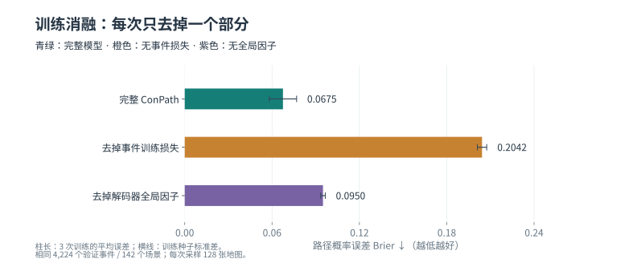

## 2. 两个部分分别有什么作用

**去掉事件训练损失：** 平均 Brier 差值为 0.13675 ± 0.01039（消融 − 完整）。三次训练的区间均高于零，支持完整模型在此验证设置下更好。

**去掉解码器全局因子：** 平均 Brier 差值为 0.02749 ± 0.00964（消融 − 完整）。三次训练的区间均高于零，支持完整模型在此验证设置下更好。

“去掉事件训练损失”只把事件损失权重设为零，仍使用同样的验证事件选最佳检查点；“去掉全局因子”只关闭解码器的全局随机因子，保留编码器全局上下文和局部相关噪声。因此，后者的结果不能解释成“所有空间相关性都有用/没用”。

| 消融 | 训练种子 | Brier 差值（消融 − 完整） | 95% 场景配对区间 | 30% 风险差值（百分点） | 风险差值 95% 区间（百分点） |
|---|---:|---:|---:|---:|---:|
| 去掉事件训练损失 | 20260831 | +0.14277 | [+0.11130, +0.17652] | +2.66 | [-0.13, +6.13] |
| 去掉事件训练损失 | 20260901 | +0.14274 | [+0.11139, +0.17645] | +3.01 | [-0.31, +6.89] |
| 去掉事件训练损失 | 20260902 | +0.12475 | [+0.09559, +0.15611] | +0.50 | [-1.61, +4.53] |
| 去掉解码器全局因子 | 20260831 | +0.03443 | [+0.01947, +0.04971] | +2.53 | [-0.08, +5.15] |
| 去掉解码器全局因子 | 20260901 | +0.03157 | [+0.02185, +0.04192] | -0.39 | [-1.38, +0.39] |
| 去掉解码器全局因子 | 20260902 | +0.01649 | [+0.00866, +0.02416] | -0.08 | [-0.78, +0.95] |

**误判风险仍没有稳定改善的证据。** 两项消融的六个 30% 覆盖率风险区间都包含零；因此，本轮可以支持总体概率误差改善，不能据此写成“安全性稳定提升”。

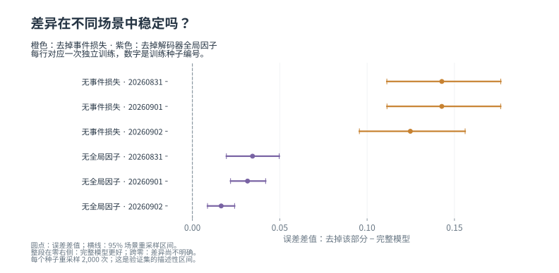

每个种子内，以整个场景为单位重采样 2,000 次（随机种子 20260907），而非把 4,224 个事件视作独立样本。三次训练的波动与场景区间分别报告，没有把预测概率平均成一个新集成模型。本批次沿用已参与检查点选择的验证集，区间仅作描述，不是经过多重比较校正的确认性检验。

## 3. 全部训练结果与分层表现

| 模型 | 训练种子 | 训练停止轮次 | 选中轮次 | 最终精确 Brier | NLL | ECE | 30% 风险 |
|---|---:|---:|---:|---:|---:|---:|---:|
| 完整 ConPath | 20260831 | 27 | 19 | 0.05948 | 0.30392 | 0.04943 | 2.80% |
| 完整 ConPath | 20260901 | 24 | 16 | 0.06522 | 0.27091 | 0.06238 | 3.30% |
| 完整 ConPath | 20260902 | 16 | 8 | 0.07778 | 0.29078 | 0.05965 | 4.70% |
| 去掉事件训练损失 | 20260831 | 12 | 4 | 0.20225 | 2.51172 | 0.20068 | 5.46% |
| 去掉事件训练损失 | 20260901 | 9 | 1 | 0.20796 | 2.48557 | 0.23828 | 6.31% |
| 去掉事件训练损失 | 20260902 | 17 | 9 | 0.20254 | 2.59471 | 0.21172 | 5.20% |
| 去掉解码器全局因子 | 20260831 | 12 | 4 | 0.09391 | 0.76014 | 0.08598 | 5.33% |
| 去掉解码器全局因子 | 20260901 | 18 | 10 | 0.09679 | 0.84783 | 0.08531 | 2.91% |
| 去掉解码器全局因子 | 20260902 | 18 | 10 | 0.09427 | 0.74662 | 0.08646 | 4.62% |

下表在每个来源或半径内部重新令场景等权，再汇总三次训练；未给每个分层追加显著性主张。半径先用“格”报告，FlatLands 论文名义分辨率与本地元数据的差异仍待核对。

| 分层 | 完整 ConPath Brier | 无事件损失 Brier | 无全局因子 Brier |
|---|---:|---:|---:|
| 机器人半径 / 0 格 | 0.07619 ± 0.00405 | 0.10123 ± 0.00960 | 0.08138 ± 0.01377 |
| 机器人半径 / 10 格 | 0.07154 ± 0.01152 | 0.30479 ± 0.00006 | 0.11226 ± 0.00871 |
| 机器人半径 / 20 格 | 0.05476 ± 0.01295 | 0.20673 ± 0.00000 | 0.09132 ± 0.00562 |
| 数据来源 / 3RScan | 0.06581 ± 0.00324 | 0.14882 ± 0.01388 | 0.07621 ± 0.02040 |
| 数据来源 / ARKitScenes | 0.06821 ± 0.00776 | 0.10237 ± 0.01791 | 0.07300 ± 0.01147 |
| 数据来源 / Matterport3D | 0.08721 ± 0.01542 | 0.27698 ± 0.00361 | 0.12699 ± 0.01166 |
| 数据来源 / ScanNet | 0.04574 ± 0.00664 | 0.12103 ± 0.00941 | 0.06623 ± 0.00169 |
| 数据来源 / ZInD | 0.07067 ± 0.01463 | 0.33615 ± 0.00826 | 0.12294 ± 0.01419 |

**大半径的漏判是一个明确失败模式。** 去掉事件训练损失后，半径 20 格的所有验证预测均为 0，但该层有 20.67% 的事件实际有路（场景等权）。这解释了为什么单元格概率图即使很绿，考虑机器人尺寸后的完整世界仍可能普遍无路。半径分层属于诊断，不能据此扩展尚未核对的物理尺度主张。

## 4. 看两个固定地图示例

以下仍是网站此前选定的两个验证示例，未根据本轮消融结果重新挑图。只展示种子 20260831；每幅图都来自真实已训练检查点，米白到青绿统一表示每个单元格的可通行概率从 0 到 1。蓝色圆点 S 是起点，棕色菱形 G 是目标；没有把两个点画成规划路线。

**obs_266762：参考地图有路，半径 10 格。**

[查看模型输入](site/assets/zh/example_positive_recovery_observed.svg) · [查看完整参考](site/assets/zh/example_positive_recovery_reference.svg)

| 完整 ConPath | 去掉事件训练损失 | 去掉解码器全局因子 |
|---|---|---|
| 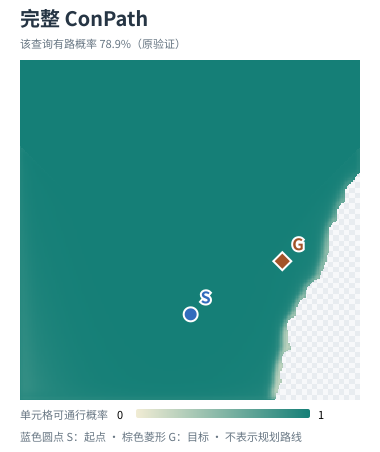 |  | 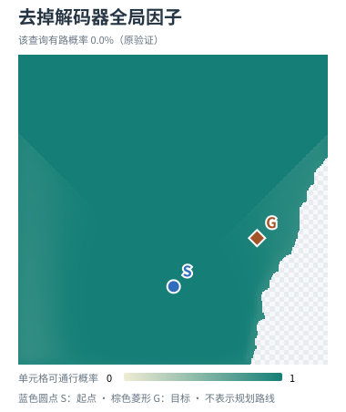 |

该查询在原精确验证中的有路概率：完整 ConPath 78.9%；去掉事件训练损失 0.0%；去掉解码器全局因子 0.0%。

下面固定展示**第 1 次实际采样，按机器人半径 10 格收缩后的图**。绿色是机器人中心可放置区域，深灰不可放置；这是一个完整世界里的判断，不是 128 次的平均概率。

| 完整 ConPath | 去掉事件训练损失 | 去掉解码器全局因子 |
|---|---|---|
| 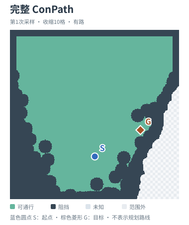 | 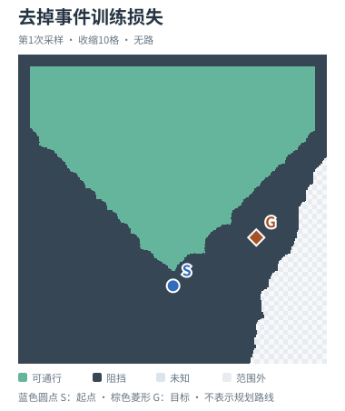 | 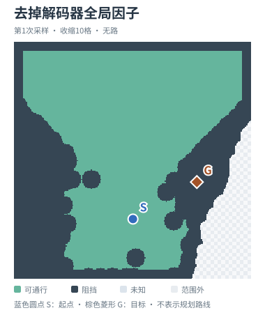 |

**obs_249512：参考地图无路，半径 20 格。**

[查看模型输入](site/assets/zh/example_false_safe_avoided_observed.svg) · [查看完整参考](site/assets/zh/example_false_safe_avoided_reference.svg)

| 完整 ConPath | 去掉事件训练损失 | 去掉解码器全局因子 |
|---|---|---|
| 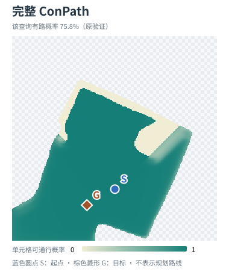 | 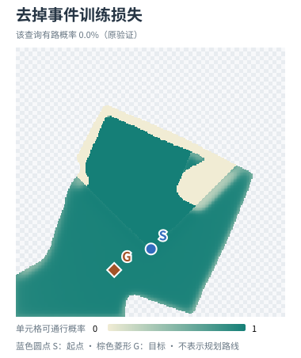 | 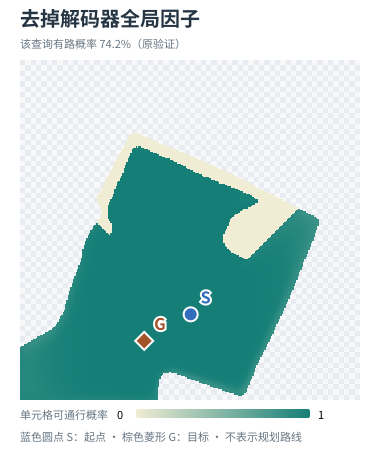 |

该查询在原精确验证中的有路概率：完整 ConPath 75.8%；去掉事件训练损失 0.0%；去掉解码器全局因子 74.2%。

下面固定展示**第 1 次实际采样，按机器人半径 20 格收缩后的图**。绿色是机器人中心可放置区域，深灰不可放置；这是一个完整世界里的判断，不是 128 次的平均概率。

| 完整 ConPath | 去掉事件训练损失 | 去掉解码器全局因子 |
|---|---|---|
| 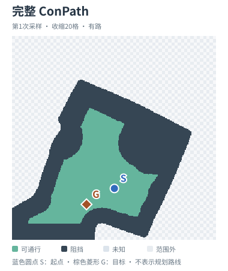 | 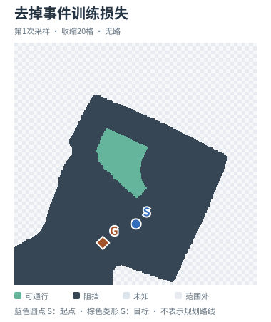 | 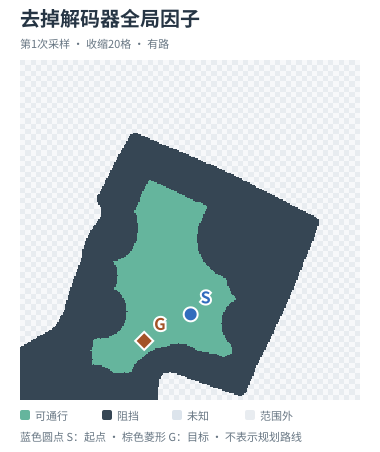 |

地图颜色由固定的新绘图随机流生成，三个模型均为 K=128、每批 8 张；标题中的通路概率直接来自原精确验证 CSV，二者随机流不同。单元格概率图与整体通路概率不同，两个解释性示例也不能代替全验证集的统计。

## 5. 论文能写什么，下一步补什么

本轮补齐了 **FlatLands 有界训练集上的三种子训练消融**，可以据实际方向讨论事件训练目标与全局解码因子的作用。“打散空间结构”的旧实验仍是固定边缘概率的评估时干预，两者回答的问题不同。

已有独立单元对照为 0.09521，同检查点的强均值地图对照为 0.06957；后者与完整模型的配对区间都包含零。这些强对照及既有 30% 覆盖率风险的无明确优势结果仍须保留，不能只展示有利消融。UnScenes3D 当前仍是观测误差下界诊断，不能写成跨域成功。

接下来按已确认方案推进：先核对 FlatLands 尺度和外部模型输入，完成固定训练样本的成本测量；然后比较 LaMa/集成、条件流匹配，并在 CogniPlan 原生地图上比较官方生成模块。新主表统一真实 K=4 输出及输入/通路几何，另报采样量与耗时成本曲线，保留强确定性和直接事件对照。如果扩大训练集，所有主表方法要在同一冻结版本重新训练。正式测试应在完整协议冻结后统一进行。

这些外部主比较尚未运行。本轮内部消融完成不等于整篇论文实验已经完成。

## 6. 复现与图片下载

- [机器可读完整统计及预测哈希](site/data/flatlands_clean_training_ablations.json)
- [每次训练结果 CSV](site/data/training_ablation_metrics.csv)
- [逐种子配对差值 CSV](site/data/training_ablation_paired.csv)
- [中文主图 PDF](site/assets/zh/training-ablation-brier.pdf) · [中文配对区间 PDF](site/assets/zh/training-ablation-paired.pdf)
- [冻结的消融协议](CLEAN_ABLATION_PLAN.md) · [后续实验方案](EXPERIMENT_DESIGN_ZH.md)

```bash
PYTHONPATH=src /home/hairo/miniconda3/bin/python3.13 scripts/build_ablation_summary_zh.py
/home/hairo/miniconda3/bin/python3.13 scripts/build_site_page.py
```

上述命令只重建已经完成并通过检查的验证汇总，不启动训练。原始地图、权重与完整预测留在本地结果目录，Git 保存汇总、代码和图表。
