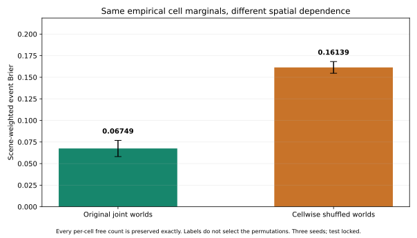
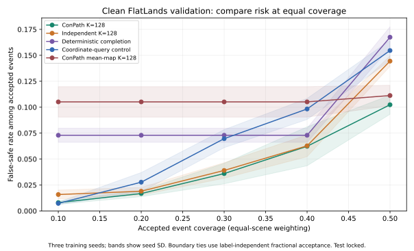
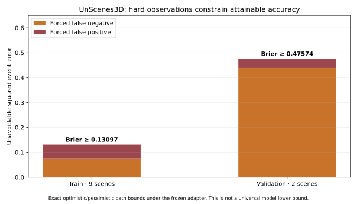
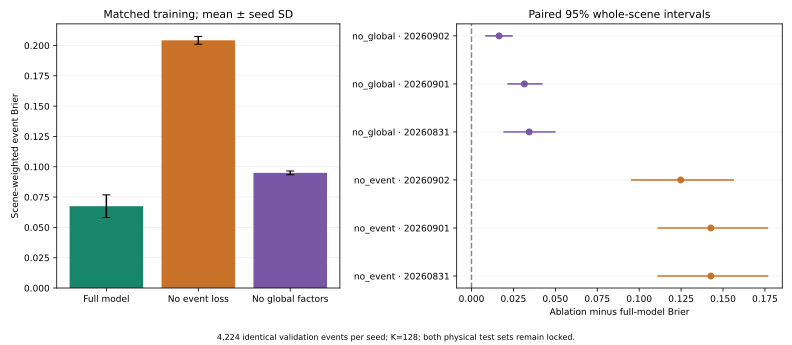

# ConPath: Connectivity-Calibrated Path Reliability from Partial BEV Observations

**读取范围更正：旧训练／验证包含原发布test中的8／5条观测，本轮回放也读取了这5条验证观测。更早的512观测查询审计检查过53条物理test观测（含32条ScanNet++）。因此撤回“物理test从未读取”的说法；旧 `test_evaluated=false` 等标志不能证明物理测试未触碰。详见[读取范围更正记录](site/data/flatlands_read_scope_erratum.json)。已停止进一步读取物理test图片，最终留出集需要审核全部历史访问并排除已检查的父级地点。**

Working manuscript, updated 2026-09-09. Physical-place isolation failed on the old FlatLands cohort; results below are diagnostic, not unseen-building evidence. Current numerical tables and standalone figures are generated in [PAPER_EVIDENCE.md](PAPER_EVIDENCE.md); a [Chinese evaluation summary](EVALUATION_SUMMARY_ZH.md) explains the new results and fixed-case images. Earlier tables and superseded experiments are preserved in [PAPER_DRAFT_HISTORY.md](PAPER_DRAFT_HISTORY.md).

**2026-09-09 更正：旧 FlatLands 队列仅隔离子场景 ID，27/160个验证观测与训练共享建筑／地点。旧数值保留为队列诊断，不能证明新建筑泛化；旧子场景配对区间也不是独立建筑总体区间。数据隔离门槛重新打开。当前统一K=4对照、90条论文公开成绩、分组修正和历史帧分析见 [最新中文评估](BASELINE_REVIEW_ZH.md)。**

## Abstract

Path reliability depends on the joint distribution of free space, whereas occupancy scores usually evaluate individual cells. ConPath learns a correlated posterior over binary support maps and estimates the probability that a path exists between two terminals for a specified disk footprint. Training combines map and spatial losses with a proper event score; evaluation uses exact discrete connectivity. A synthetic repeated-world experiment passes in two optimization seeds, while a matched model without the event loss fails. On a frozen, non-official FlatLands diagnostic cohort with distinct subscene IDs but overlapping parent places, three corrected training runs achieve event Brier 0.06749 versus 0.09521 for a matched independent decoder. Matched retraining without the event loss or global decoder factors yields Brier 0.20425 and 0.09499, respectively; all six within-seed paired scene intervals favor the full model. Permuting sample indices separately at every cell preserves all empirical occupancy marginals but worsens event Brier to 0.16139, isolating a role for spatial dependence. The advantage over a deterministic map from the same checkpoint is smaller and inconsistent across seeds. Equal-coverage risk intervals do not establish a stable safety improvement over the independent decoder or either training ablation. A second-domain audit identifies an observation-conditioned error floor that limits the current UnScenes3D adapter. A new audit identifies shared training places in 27 of 160 validation observations, invalidating an unseen-building interpretation of this cohort and its subscene-based intervals. At K=4, ConPath event Brier is 0.08007 versus 0.07237 for an untrained all-free completion rule, while their equal-30%-coverage error rates are 4.89% and 13.43%. These mixed diagnostics motivate stronger controls and fresh parent-grouped training. External-paper superiority, final testing and robust generalization remain unestablished.

## 1. Problem and scope

For a partial BEV observation `X`, a supplied validity domain `V`, start `s`, goal `g`, and disk radius `r`, the quantity of interest is

```text
q_theta(s,g,r | X,V)
  = E_{M ~ p_theta(M | X,V)} [1{a support-valid path exists from s to g for radius r}].
```

Identical probabilities at individual cells do not determine this expectation: dependence can change whether a bottleneck opens as a coherent region. We evaluate map marginals, joint sample structure, and path events separately. Lower map error alone does not establish better event reliability.

The prototype operates on rasters, circular footprints, and four-neighbor connectivity. It does not implement vehicle dynamics, an arbitrary SE(2) swept footprint, or a collision guarantee. Released validity masks define the benchmark support domain; UnScenes3D uses label validity as a supplied support mask. This is a benchmark condition, not evidence that the same support domain is available to a deployed robot.

## 2. Comparison with related methods

The comparison separates deterministic completion, independent stochastic completion, joint stochastic completion, and direct event prediction. The primary dependence comparison matches encoder capacity and sample budget. The fixed-marginal shuffle additionally changes the joint arrangement of generated worlds while preserving every empirical cell probability, addressing a confound that separately trained models cannot eliminate.

The coordinate-query control is inspired by implicit-field representations; it is not a faithful S4C reproduction. Sources, task differences, and implementation status are recorded in [RECENT_BASELINES.md](RECENT_BASELINES.md). An eight-paper review now prioritizes BEV completion over a wholesale transition to 3-D SSC: the FlatLands benchmark compares completion families under shared BEV conditioning; MapEx uses LaMa-based map predictions; CogniPlan provides a conditional generative map module with native layout-type supervision. PaSCo's separate common-backbone uncertainty comparisons and S4C's re-evaluation under a shared support mask inform the proposed controls. The review and source locations are recorded in [LITERATURE_REVIEW_ZH.md](LITERATURE_REVIEW_ZH.md).

The external comparison candidates include LaMa/ensemble, conditional flow completion, and CogniPlan. The revised execution preference is to reuse compatible published scores first, then author predictions or checkpoints, and undertake only necessary common-protocol adaptation training. The generator's layout labels prevent treating a file-path replacement as a faithful FlatLands transfer. These experiments have not been run. Engineering implementations retain their core mechanisms and disclose changes; full navigation-system claims require separate closed-loop evaluation. Cross-task 3-D mIoU, FID, or exploration scores do not enter the event table. [EXPERIMENT_DESIGN_ZH.md](EXPERIMENT_DESIGN_ZH.md) specifies a new matched-output K=4 comparison and measured cost curves; neither overwrites the frozen K=128 validation evidence.

## 3. Method

### 3.1 Correlated map posterior

Three input channels encode observed free, observed blocked, and unknown cells. A compact BEV encoder supplies a two-class mean-logit head, low-rank global factors, and locally correlated stochastic logits. The final FlatLands model uses feature width 16 and four global latent dimensions, with 120,108 parameters. The matched independent decoder uses the same capacity, disables global factors, and uses a one-cell local kernel.

Observed evidence is clamped in each world, and the complement of `V` is always blocked before sampling. `UNKNOWN` is an observation state, not a third physical world class. The exact target geometry uses the same support boundary. Earlier forwards omitted this boundary; only checkpoints retrained with the corrected contract supply current main results.

### 3.2 Footprint-conditioned connectivity

Eroding a sampled free set by a discrete radius-`r` disk gives valid vehicle-center positions. The event is one when `s` and `g` belong to the same four-connected component after erosion. Equivalently, let `C*(s,g;M)` be the maximum, over all paths, of the minimum clearance along the path. Then

```text
q_hat(s,g,r) = (1/K) sum_k 1{C*(s,g;M_k) >= r}.
```

Using the same worlds for every radius makes probability non-increasing with vehicle size. Invalid endpoints are unreachable. Final predictions use exact disk clearance and connectivity. A NumPy merge-tree reference supplies the correctness oracle; the accelerated connected-component evaluator checks itself against that oracle before loading checkpoints.

### 3.3 Training and checkpoint selection

The objective combines posterior-marginal NLL, a variogram term, and an event U-statistic Brier estimator. For binary sample events `z_k` and target `y`,

```text
L_U = ((sum_k z_k)^2 - sum_k z_k) / (K(K-1)) - 2 y mean_k(z_k) + y^2.
```

Its expectation is the squared error of the underlying event probability without the additional Monte Carlo variance penalty of the plug-in training Brier. Evaluation uses ordinary Brier, NLL, and ECE. Straight-through samples and a relaxed connectivity backward path provide gradients. Public-data training uses a bounded 256-step propagation budget; this is not a globally exact large-map training operator.

Clean FlatLands runs use eight training worlds, 128 validation worlds in chunks of eight, AdamW with learning rate 0.0003, at most 40 epochs, and patience eight. Both decoders use the same three optimization seeds. Checkpoint selection evaluates up to eight fixed target-blind queries per observation with bounded propagation; final exact evaluation includes all retained queries. The selection/evaluation operator difference remains a limitation. New analyses do not retune checkpoints, query selection, split, or radii.

## 4. Experimental protocol

### 4.1 Synthetic hypothesis test

P0 holds out scene templates, supplies visible context distinguishing hidden-door priors, and repeats hidden worlds for the same observation. Two full-model seeds obtain event Brier 0.116377 and 0.111621, versus 0.183172 for independent Bernoulli and 0.169888 for direct query. A matched no-event-loss run obtains 0.191368 despite comparable map marginals. Residual fragmented doorway samples remain a limitation. These are synthetic results; exact gates and configurations are in [P0_DEATH_TEST.md](P0_DEATH_TEST.md).

### 4.2 FlatLands validation

The published observation-directory split fails scene isolation. We use the explicitly non-official `provenance.original_split`, preserving upstream scene memberships. The bounded dataset/query manifest is frozen. The current comparison has 4,224 event rows from 1,408 endpoint groups across 142 contributing validation scenes, at radii 0, 10, and 20 cells. All methods use identical event keys. No test set is used for model selection or evaluation in this analysis.

Each scene receives equal total weight and each event within it equal weight. Three-seed variability is sample standard deviation. Paired uncertainty resamples whole scenes 2,000 times within each seed; event rows are not independent observations. The exploratory comparisons are not adjusted confirmatory significance tests.

The clean training ablations use the same 160 training and 160 validation packets, seeds, optimizer, support policy, bounded checkpoint-selection operator, and exact K=128 final evaluator as the full model. Each run starts from its seed's random initialization. No-event changes only the event-loss weight from 2 to 0, retaining event-based validation checkpoint selection. No-global disables only the decoder's low-rank global factors; encoder context, local correlation (kernel size 5), and the variogram loss remain enabled. The primary contrast is ablation minus full-model scene-weighted Brier, paired by training seed. The ablation analysis plan fixed 2,000 whole-scene resamples with bootstrap seed 20260907 before inspecting outcomes. This retraining intervention is separate from the fixed-checkpoint, fixed-marginal shuffle.

Selective risk uses scene-weighted coverage. Every event tied at the boundary probability receives the same acceptance fraction independently of its label. This achieves requested coverage in expectation, including binary predictors. Each bootstrap replicate recomputes its coverage boundary. These curves describe validation ranking behavior; they are not fitted deployment thresholds.

### 4.3 Second-domain diagnosis

The frozen UnScenes3D LiDAR/ground-valid adapter uses nine training scenes and two validation scenes, with 478/62 frames and 15,567/1,529 queries. Three radii yield 46,701/4,587 events. The test site `location_6` remains unopened. Six fresh correlated/independent adapters pass support/checkpoint audits. Their deterministic K=128 mean-map events form a transfer diagnostic with a different predictive object from the primary stochastic event table.

### 4.4 External baseline preparation (no comparative results yet)

We have frozen a new, non-official split of CogniPlan's original inpainting training maps: 2,400 training, 300 calibration, and 300 validation mother maps, corresponding to 19,045, 2,369, and 2,381 partial observations. Grouping includes exact geometry matches under all eight square rotations/reflections; no such duplicate groups were found among the 3,000 mothers. Each layout contributes 800/100/100 mothers, and every partial observation inherits its mother's split. The public generator was trained using the original training asset, so its predictions on any of these subsets are training-domain interface checks, not held-out evidence. All formal methods must be retrained on the shared split.

The pinned official CogniPlan generator, four fixed inference conditions, grayscale normalization, padding/cropping, threshold and morphology were exercised on 32 preselected training observations. All 128 hard maps exactly replay the native postprocessing with zero observed-cell conflicts. Reconstruction and adversarial phases each received 10 warmup and 100 measured updates; the adapted optimizer sequence also exactly matches the official loop in three update branches. These checks establish numerical compatibility, not convergence, comparative accuracy, or navigation performance. Example outputs, including incorrect hidden geometry, and resource estimates under concurrent GPU load are documented in [EXTERNAL_PROGRESS_ZH.md](EXTERNAL_PROGRESS_ZH.md). They are excluded from the validation result tables and isolated-device runtime claims. Common queries and final training recipes remain pending. A pinned Big-LaMa Fourier backbone adapted to shared BEV conditioning and a documented FM+XAttn literature reimplementation have now also passed short, training-only engineering checks. Each completed 100 measured effective-batch-64 optimizer updates; this establishes neither convergence nor external comparative accuracy. The shared support channel, BEV loss normalization, chosen flow-network architecture, microbatch BatchNorm behavior, and actual Heun/CFG forward counts are disclosed in [FLATLANDS_EXTERNAL_PROGRESS_ZH.md](FLATLANDS_EXTERNAL_PROGRESS_ZH.md). These uncalibrated diagnostic outputs are excluded from the result tables.

The 160 inspected FlatLands training metadata records consistently specify a 512-to-256 crop retaining a 0.01 m/cell field. This agrees with the paper's crop description but does not resolve its separate 0.039 m/cell downsampling description. We retain cell-radius results without claiming independently verified physical scale.

## 5. Historical-cohort diagnostic results

The full nine-control table, per-seed paired intervals, source/radius results, and prediction hashes are in [PAPER_EVIDENCE.md](PAPER_EVIDENCE.md) and [the machine-readable analysis](site/data/flatlands_clean_paper_analysis.json).

### 5.1 Event accuracy and dependence

ConPath Brier is 0.06749 ± 0.00936 versus 0.09521 ± 0.00703 for the independent decoder. The paired mean reduction is 0.02772, with positive scene-bootstrap intervals in all three seeds. Deterministic completion and coordinate query obtain 0.08857 and 0.09204; their third-seed paired Brier intervals include zero, so the evidence does not establish a uniformly decisive improvement over every comparator.

Separately trained correlated and independent models have different hidden-map Brier (0.15451 versus 0.16789), so that comparison alone does not hold marginals fixed. The shuffle intervention preserves every empirical per-cell count in the original 128 worlds, changing only world-index alignment between cells. Event Brier rises to 0.16139 ± 0.00677. This supports a dependence mechanism in the frozen samples; it does not replace clean no-event/no-global training ablations or prove generalization.



### 5.2 Strong mean-map control and selective risk

Thresholding the same ConPath checkpoint's posterior mean at 0.5 gives Brier 0.06957 ± 0.00380; the independent checkpoint's mean map gives 0.07184 ± 0.00349. The stochastic-versus-mean-map gap is small and reverses in one seed. The stochastic method cannot be described as uniformly better than deterministic thresholding on this benchmark.

At confidence 0.8, ConPath has lower false-safe rate (0.04552 versus 0.05689) but different coverage (0.33644 versus 0.36592). At equal 30% coverage, risks are 0.03600 and 0.03901; all three per-seed paired intervals include zero. This does not support a robust equal-coverage safety claim.



### 5.3 Sample-budget sensitivity

The saved final sampling state reproduces every original K=128 event probability across six checkpoints with zero drift. Nested prefixes give ConPath Brier 0.06861 / 0.06771 / 0.06749 at K=32 / 64 / 128, and independent Brier 0.09575 / 0.09540 / 0.09521. Aggregate changes over these budgets are small relative to seed variation. This is fixed-checkpoint sensitivity, not arbitrary-K convergence or a training-budget ablation.

### 5.4 Second-domain observation constraints

Clean UnScenes3D mean-map Brier is 0.51142 ± 0.00198 versus 0.51130 ± 0.00218 for the independent decoder. The near-zero difference is not evidence of successful transfer. A final mean-map projection audit found that restoring observed-free cells could reopen invalid support after correct model sampling. Version 2 applies the support mask last in both the evaluator and renderer; all six checkpoints and hidden-map metrics reproduce exactly, and all 27,522 corrected event predictions satisfy the observation bounds. Superseded v1 predictions remain available for audit.

Let `F_min` contain only observed-free valid cells, and let `F_max` also free every unknown valid cell. Every world respecting the hard observation lies between these sets. Disk erosion and connectivity are monotone, so its event is bounded by the pessimistic and optimistic events. A positive target with optimistic event zero, or a negative target with pessimistic event one, forces Brier error one for every such posterior. This yields a lower bound without selecting model parameters.

All 51,288 train/validation event labels were replayed against the exact oracle. The scene-weighted Brier lower bound is 0.13097 on training and 0.47574 on validation. Only 15.66% of validation events are mutable through unknown completion; the lower bound accounts for about 93% of current mean-map error. Further optimization cannot remove this forced component. A future adapter should first revisit the observation likelihood using training data and a separately versioned protocol. The bound applies to the frozen hard-observation adapter, not to all sensor models or the dataset in general.



### 5.5 Clean training ablations

All six clean retrainings passed the frozen configuration, checkpoint, support, query-key, and metric-replay audits. Removing the event training loss raises Brier from 0.06749 ± 0.00936 to 0.20425 ± 0.00322; removing the decoder's global factors yields 0.09499 ± 0.00157. The mean ablation-minus-full differences are +0.13675 ± 0.01039 and +0.02749 ± 0.00964 across the three training seeds. Every per-seed 95% whole-scene Brier interval is positive: no-event intervals are [0.11130, 0.17652], [0.11139, 0.17645], and [0.09559, 0.15611]; no-global intervals are [0.01947, 0.04971], [0.02185, 0.04192], and [0.00866, 0.02416]. These descriptive reused-validation results support both design choices under the current bounded-data protocol.

The radius analysis identifies a specific no-event failure mode: all radius-20 validation probabilities are zero in every seed, although the scene-weighted positive rate is 20.67%. Radius-10 predictions are also almost entirely zero. Thus, visually high cell probabilities do not ensure coherent sampled free regions large enough for the robot. This is a diagnostic on the frozen cell radii; the unresolved physical-resolution discrepancy prevents extending the conclusion to new metric footprints. Source/radius results and both pre-existing illustrative cases are retained in the Chinese summary. The latter includes probability maps and the first sampled world's disk-eroded support, with no outcome-based sample selection.

At equal 30% coverage, mean false-safe rates are 3.60% for the full model, 5.65% without event loss, and 4.29% without global factors. All six paired risk intervals include zero, and the no-global point contrast reverses in two seeds. Better overall Brier does not establish a stable selective-risk improvement. The ablations also do not remove the close same-checkpoint mean-map control or substitute for the planned external methods.



## 6. Reproducibility and limitations

Source, protocol, checkpoint and prediction hashes accompany the reports. The checkpoint environment uses Python 3.13.13. Reruns restore the saved CUDA sampling state and validate exact geometry. Commands and downloadable SVG/PDF figures are in [PAPER_EVIDENCE.md](PAPER_EVIDENCE.md). Real checkpoint-derived positive and false-safe panels disclose their label-based explanatory case selection.

Limitations include validation reuse for checkpoint selection, the non-official split, source/radius-dependent prevalence, two second-domain validation scenes, hard observation assumptions, and bounded differentiable propagation. Current NumPy/accelerated CPU inference diagnostics do not establish a scalable CUDA backward operator. There is no claimed end-to-end sensor fusion, real-robot navigation, rectangular footprint, or certified collision result.

## 7. Current research decision

The evidence supports further study of joint map structure and event scoring. It does not yet meet the final-paper gate: deterministic controls remain close, equal-coverage risk improvement over the independent decoder is not stable, and the second-domain adapter has a large observation-conditioned error floor.

The clean three-seed no-event/no-global matrix is now complete under the frozen [ablation analysis plan](CLEAN_ABLATION_PLAN.md). The external-method interfaces have passed short engineering checks. The next milestone is to freeze shared data and queries and establish adequate baseline convergence; the discrepancy between the FlatLands paper's nominal spatial resolution and the local release metadata remains unresolved, so physical-footprint claims cannot yet be expanded. LaMa/ensemble and conditional flow completion on FlatLands, and CogniPlan's generator on native maps, remain required under [EXPERIMENT_DESIGN_ZH.md](EXPERIMENT_DESIGN_ZH.md). The new matched-output K=4 table requires common data and geometry; a larger training set requires retraining all relevant methods under one new version.

Before another UnScenes3D matrix, a training-only observation-model audit must address its error floor without held-out test labels. Scalable-operator evidence, measured cost curves, the external-method comparison, and a frozen test protocol remain necessary. Pause/resume execution history and completed checkpoint identities are preserved in CONTINUATION.md and RECOVERY_STATE.json. This remains a working draft; final public-data, transfer, and submission-ready claims are unsupported.

## 8. New baseline and data audit (2026-09-09)

The [Chinese baseline review](BASELINE_REVIEW_ZH.md) supplies the complete local K=4 table, 90 versioned published reference values, and protocol mismatches. Map MES and oracle best-of-K IoU from FlatLands cannot replace path-event Brier or label-blind mean-of-K prediction. Published values remain in a separate reference table; no external-model superiority is established.

Upstream house/space/home/visit/reference-rescan grouping finds 19 Matterport3D, 5 3RScan, 2 ZInD and 1 ScanNet validation observations sharing a training parent. ARKitScenes has zero such overlap in the selected cohort. Historical exact numerical replays remain valid, but existing subscene bootstrap intervals are conditional diagnostics. Simply removing overlapping validation rows cannot create a fresh holdout for checkpoints already selected on that validation set. A metadata-only candidate partitions 215,289 physical-train observations into 3,589/445/445 parent groups for training/calibration/development validation, with zero cross-partition parent overlap. It quarantines 53 observations lacking visit IDs. Quality, scale, query and independent final-test gates remain open; the original physical ID test also overlaps development parents. New experiments require training from scratch.

A train-only UnScenes3D audit of 36 frames from nine scenes finds 22.75% observed-valid cell conflict. Of 307 observation-forced false-negative events, 207 have a directly blocked endpoint. On 27 strictly causal historical pairs, a calibration-derived pose candidate increases mean 0.3-m overlap from 39.38% to 45.59%, but improves median distance in only 11 pairs; independent ego-pose files validate only four sampled frames. Neither temporal prediction quality nor a Transformer benefit has been measured. Proposed work prioritizes observation likelihood and terrain representation, then confidence-gated geometric fusion, followed by a matched single/history-frame by convolution/attention factorial design. Future frames and accumulated complete maps are excluded. Data-scale experiments distinguish independent places from repeated views.

The physical-test access claim is also withdrawn: the old development manifest included eight original archive-test observations in training and five in validation; the current replay read those five. Earlier bounded query auditing inspected 53 original archive-test observations, including 32 ScanNet++ scenes. Historical false test-access flags do not establish an untouched holdout. No further physical-test PNG access is allowed, and final holdout eligibility requires a complete access audit and exclusion of already-inspected parent groups.
