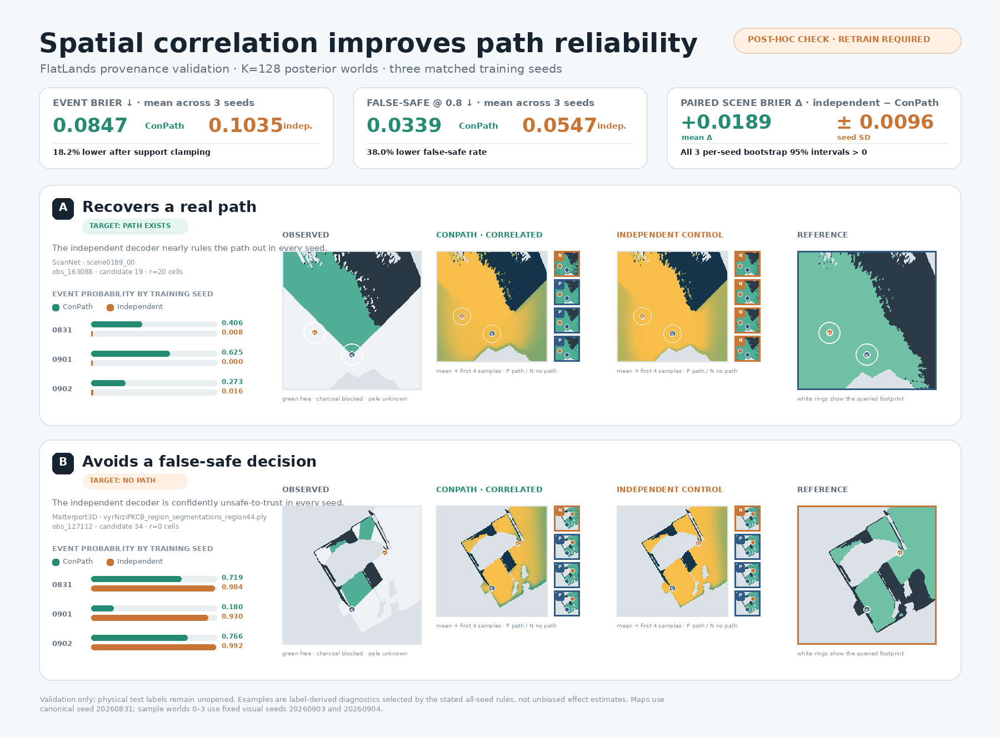
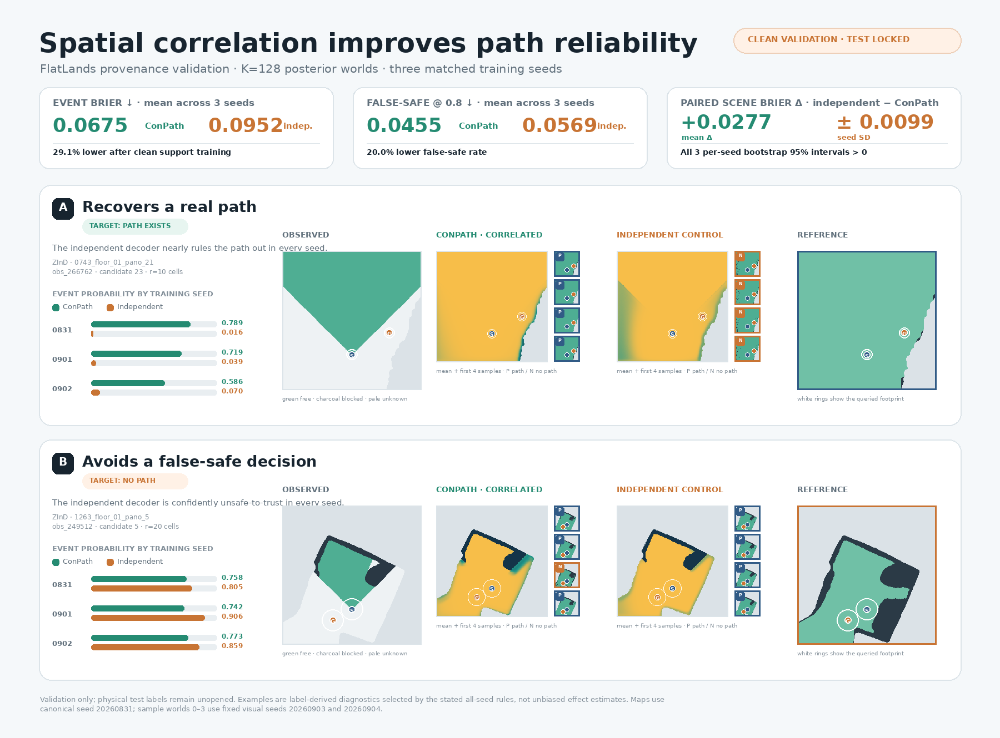

> Historical draft retained for the support-boundary audit trail. Current claims and results are in PAPER_DRAFT.md and PAPER_EVIDENCE.md.

# ConPath: Connectivity-Calibrated Path Reliability from Partial BEV Observations

This is the writing scaffold for the first IROS submission. It deliberately separates results that
are already reproducible in this repository from claims that require a trained CUDA model and public
data.

## Abstract (working version)

Most uncertainty-aware navigation systems calibrate occupancy at individual voxels, while a robot
ultimately needs a decision about a non-local event: whether a start and goal are connected for its
footprint. These objectives are not equivalent. ConPath predicts a correlated posterior over binary
support maps and derives the two-terminal, footprint-conditioned path event from sampled maps. The
posterior is trained with a proper event score together with marginal and spatial scores; the event
operator uses exact binary geometry in the forward pass and a straight-through surrogate only for
learning. We introduce a held-out-template synthetic death test in which visible observations have
different context-conditioned doorway priors and repeated hidden worlds, making independent-cell
completion statistically misspecified. Two CUDA-trained optimization seeds obtain event Brier
scores of 0.1164 and 0.1116, compared with 0.1832 for independent cells and 0.1699 for direct query;
a matched model without the event loss obtains 0.1914 despite comparable map-marginal Brier. These
numbers close a synthetic hypothesis audit on one fixed split, not a public-data or real-robot
result. The final paper must evaluate event calibration on versioned occupancy data with
site/sequence-held-out splits and public completion baselines.

## Claim boundary

The paper claims a task-level probabilistic interface:

```text
q_theta(s, g, r | X) = P(there exists a support-valid four-connected path
                         for a disk footprint of radius r | partial BEV X).
```

It does not claim a complete RGB-to-BEV system, dynamics or collision guarantee, arbitrary SE(2)
footprints, or calibrated performance on a public dataset until those experiments are complete.
`TRAVERSABLE` and `BLOCKED` are the only latent world classes; `UNKNOWN` is an observation/validity
state.

## Dataset plan and readiness (2026-09-04)

The minimum defensible evidence package for the paper is the synthetic P0 death test plus one
scene-held-out public event benchmark. The current recommended primary real-data benchmark is the
FlatLands provenance split: the archive is present locally and its bounded 512-scene validation
pipeline and natural-query audit are complete. A 2026-09-03 model audit found that the original
three-seed F=16 ConPath and matched-control forwards did not hard-block cells outside
`epistemic_mask`; those matrices are now superseded. A fresh support-consistent K=128 retraining has
now completed for both decoder variants and passed the strict replay/audit gate.
This split is explicitly
**non-official** because the published directory split is scene-leaky; any result from it must be
labelled validation-only/non-official until a clean official split is available.

UnScenes3D is the secondary-domain option. Its raw images, labels, and both local-map packages are
present locally, and its train/validation ground-valid coordinate/manifest contract is complete.
The old map-derived controls are superseded by the valid-support audit; the support-consistent clean
rerun is complete as a validation diagnostic. Its exact K=128 paired delta is only `+0.00036 ±
0.00062` over two held-out scenes, so it shows no measurable correlation gain. It remains
validation-only with `location_6` locked and cannot support a final public-data or cross-domain claim.
A one-time test
evaluation requires a separate explicit go/no-go after all controls and hyperparameters are frozen.

The TUM RGB-D `freiburg1/desk` package is available and useful for the RGB-D-to-world-frame geometry
figure, but it has no traversability labels and is not a final quantitative benchmark. ORFD and
WildOcc are not present locally and are optional future second-domain additions, not prerequisites
for the current minimum package. Thus the required files for the current validation package are
present; the final paper dataset gate is not yet closed because of the FlatLands provenance caveat
and the locked UnScenes3D test site.

## Support-boundary correction (2026-09-03; publication hold)

The FlatLands label oracle defines cells outside `epistemic_mask` as invalid support, while the
canonical three-channel tensor encodes those cells as all-zero. The earlier ConPath forward clamped
observed free/blocked cells but left the all-zero cells stochastic. A model could therefore predict
and use a route outside the valid map even though the target oracle correctly rejected that route.
This is a protocol violation, not a cosmetic visualization issue. No physical test labels were read
while finding or correcting it.

`PathRelNet` now accepts an explicit `valid_support_mask` and deterministically clamps its complement
to `BLOCKED` before posterior sampling and connectivity. The FlatLands collation/training path passes
`epistemic_mask`, and two regression tests cover clamping and shape rejection. A SciPy-accelerated
validation recovery evaluator was checked against the canonical NumPy clearance and merge-tree
oracle on random maps before use. Re-evaluating the six old K=128 checkpoints under the corrected
boundary gives:

| Decoder | Brier | NLL | ECE | False-safe @0.8 | Coverage @0.8 |
|---|---:|---:|---:|---:|---:|
| Correlated ConPath | **0.08467 ± 0.01350** | **0.40035 ± 0.06452** | **0.08979 ± 0.01627** | **0.03391 ± 0.00722** | 0.28150 ± 0.02290 |
| Independent control | 0.10352 ± 0.00388 | 0.84715 ± 0.01366 | 0.09964 ± 0.01038 | 0.05468 ± 0.00678 | 0.33801 ± 0.00779 |

The independent-minus-correlated Brier delta is `+0.01886 ± 0.00963`; the per-seed paired
scene-bootstrap intervals are `[0.00127, 0.01851]`, `[0.01888, 0.03833]`, and
`[0.00963, 0.02725]`. Thus the correlation direction survives the correction, but these are
**post-hoc evaluations of checkpoints trained under the faulty forward**. They diagnose the effect
and support continuing the experiment; they are not eligible for the paper table. Clean three-seed
correlated and independent K=128 runs were started in new output directories after the 80-test
regression gate passed. The project-page replacement visual and its hashes/selection rules are in
`site/data/flatlands_k128_support_clamped_advantage.json`.



*Diagnostic figure, not a paper result.* Both examples and every displayed probability come from
the frozen validation replay and real checkpoints. Validation labels select the two explanatory
cases under the recorded all-seed rules; the panel is not an unbiased effect estimate, and its
orange badge records that clean retraining is required.

## Clean support-consistent FlatLands K=128 rerun (validation candidate; 2026-09-04)

The six new F=16 checkpoints were trained with the corrected `valid_support_mask` contract in both
training and validation. Each seed has 4,224 finite validation rows (1,408 endpoint groups), K=128
posterior worlds, identical frozen query keys, and `test_evaluated=false`. The strict audit checks
checkpoint restoration, implementation hashes, support clamping, radius monotonicity, exact NumPy
replay, and the locked test boundary; all six runs pass with zero failures.

| Decoder | Brier | NLL | ECE | False-safe @0.8 | Coverage @0.8 |
|---|---:|---:|---:|---:|---:|
| Correlated ConPath (clean) | **0.06749 ± 0.00936** | **0.28854 ± 0.01662** | **0.05715 ± 0.00683** | **0.04552 ± 0.01429** | 0.33644 ± 0.00579 |
| Independent control (clean) | 0.09521 ± 0.00703 | 0.78503 ± 0.04690 | 0.08720 ± 0.00741 | 0.05689 ± 0.00832 | 0.36592 ± 0.01692 |

The paired independent-minus-ConPath Brier delta is `+0.02772 ± 0.00993`. Per-seed 2,000-draw
scene-bootstrap 95% intervals are `[0.02416, 0.05480]`, `[0.01604, 0.02801]`, and
`[0.01239, 0.03220]`; all are strictly positive. These numbers are a reproducible
**validation-only candidate**, not an official FlatLands or final paper result: the provenance
split is non-official because the published directory split is scene-leaky, and no physical test
labels were opened. The paired report is `site/data/flatlands_k128_support_clamped_paired_comparison.json`,
and the real-checkpoint visual is `site/assets/flatlands_k128_clean_candidate.png` with provenance
in `site/data/flatlands_k128_clean_candidate.json`.

The visual selects explanatory validation cases using labels, so it is qualitative evidence rather
than an unbiased effect-size estimate. It is suitable for the local project page and review of the
pipeline; it must not be presented as a test-set or leaderboard figure.



*Validation candidate only; physical test remains locked and the non-official provenance split
precludes a final paper claim.*

All pre-correction FlatLands PathRelNet-derived values below are retained only as an audit trail and
are superseded. The fixed completion baselines already build worlds from observed-free cells plus
the support-masked `unknown` region, so they never route outside `epistemic_mask`; radius-prior and
direct-query rows do not sample map paths. Those fixed baselines remain valid validation controls.
UnScenes3D PathRelNet-derived controls are being rerun under the analogous `target_valid` hard
support boundary before promotion; `location_6` remains locked.

## Superseded pre-correction public-data checkpoint (audit trail only)

The first FlatLands pass uses a bounded 512-scene sample from the explicitly non-official
`provenance.original_split` (160 train / 160 validation / 192 test scenes). The published archive
directory split is scene-leaky and is never used for cross-scene evidence. On the frozen validation
queries, the radius-prior, deterministic completion, independent-cell K=32, and direct-query
baselines obtain scene-weighted Brier scores 0.15870, 0.08556, 0.22546, and 0.09119, respectively.
The direct-query comparator has the best NLL/ECE, while deterministic completion has the best Brier.
These are evaluator and difficulty diagnostics only: one optimization seed, validation only, no
official completion weights, and no test labels read. The site labels this section “validation-only /
test locked / not final paper result.”

## Superseded FlatLands K=128 ConPath validation candidate (audit trail only)

The F=16 ConPath contract was rerun with the protocol's final posterior budget, 128 validation
worlds accumulated as K=8 chunks, on the same 160 train / 160 validation provenance scenes and
frozen 0/10/20-cell query radii. The exact validation forward is the NumPy disk-clearance plus
batched Kruskal/LCA oracle; metrics use equal-scene weighting and 2,000 scene-cluster bootstrap
replicates. All three manifests contain 4,224 rows (1,408 endpoint groups), and every run records
`paper_result=false` and `test_evaluated=false`.

| Seed | Best epoch | Exact validation Brier | NLL | ECE | False-safe @0.8 |
|---:|---:|---:|---:|---:|---:|
| 20260831 | 4 | 0.10465 | 0.49132 | 0.08680 | 0.04299 |
| 20260901 | 16 | 0.08285 | 0.40156 | 0.05628 | 0.05648 |
| 20260902 | 8 | 0.10000 | 0.39265 | 0.06794 | 0.06611 |
| **mean ± sample SD** | — | **0.09583 ± 0.01148** | **0.42851 ± 0.05458** | **0.07034 ± 0.01540** | **0.05519 ± 0.01161** |

The corresponding F=16 K=32 matrix is `0.09607 ± 0.01222` Brier, `0.45814 ± 0.16071` NLL,
and `0.06870 ± 0.01659` ECE. Thus the K=128 replay is consistent with the existing three-seed
dispersion and is a reasonable validation candidate, not evidence for a public-data leaderboard
claim. The final exact manifests, seed hashes, and audit flags are in
`site/data/flatlands_conpath_k128_validation.json`; the physical test split remains locked and
the non-official provenance caveat still applies.

## Superseded matched independent-decoder K=128 control (audit trail only)

As a capacity- and sample-matched causal diagnostic, the same F=16 encoder, 160/160 provenance
scene split, optimizer, query rows, radii, exact NumPy forward, and K=128 posterior budget were
rerun with the decoder's spatial correlation removed (`local_kernel_size=1`, effective global
factors disabled). The explicit CLI ablation flag was not combined with the independent variant;
the run metadata records the effective setting. No physical test labels were read.

| Seed | Best epoch | Epochs | Selection Brier | Exact validation Brier | NLL | ECE | False-safe @0.8 | Coverage @0.8 |
|---:|---:|---:|---:|---:|---:|---:|---:|---:|
| 20260831 | 4 | 12 | 0.08698 | 0.11476 | 0.86451 | 0.09921 | 0.07882 | 0.34011 |
| 20260901 | 10 | 18 | 0.07978 | 0.11032 | 0.85464 | 0.08716 | 0.07130 | 0.35626 |
| 20260902 | 10 | 18 | 0.08993 | 0.11673 | 0.91047 | 0.10507 | 0.08560 | 0.34424 |
| **mean ± sample SD** | — | — | **0.08556 ± 0.00522** | **0.11394 ± 0.00328** | **0.87654 ± 0.02979** | **0.09715 ± 0.00913** | **0.07857 ± 0.00715** | **0.34687 ± 0.00839** |

Under the same contract, the correlated ConPath K=128 candidate is `0.09583 ± 0.01148` Brier,
`0.42851 ± 0.05458` NLL, and `0.07034 ± 0.01540` ECE. The independent decoder is therefore a
useful directionally consistent control for the role of spatial correlation, while its higher
false-safe rate and NLL also show that the comparison is not an unconditional safety guarantee.
The three 4,224-row manifests pass exact evaluator replay, hash/range checks, and radius ordering;
the complete audit is `results/p1_flatlands_independent_k128_validation_v2/audit.json` and the
portable hand-off is `site/data/flatlands_independent_k128_validation.json`. This remains a
validation diagnostic on a non-official provenance split, not a final paper or leaderboard result.
All six selected K=128 checkpoints (three correlated and three independent) restore into the
current `PathRelNet` with zero missing/unexpected state keys and `120,108` trainable parameters;
the independent control changes decoder correlation, not model capacity.

### Paired effect-size check

Because both controls emit predictions for the identical frozen keys, we also resampled complete
`(source_dataset, scene_id)` clusters in paired fashion (2,000 draws per seed). The independent
minus correlated scene-weighted Brier deltas are `+0.01011` (95% CI `[0.00286, 0.01839]`) for
seed 20260831, `+0.02747` (`[0.01661, 0.03770]`) for seed 20260901, and `+0.01673`
(`[0.00816, 0.02585]`) for seed 20260902. The three-seed delta is `+0.01810 ± 0.00876`.
NLL, ECE, and false-safe deltas point in the same direction, while the independent decoder has
higher accepted-event coverage; therefore this is a matched effect-size diagnostic rather than a
claim of statistical significance or a safety guarantee. The full paired report is
`site/data/flatlands_k128_paired_comparison.json`.

## Second-domain validation-only control package (historical audit; 2026-09-02)

The coordinate-audited UnScenes3D mini release is now a second-domain adapter diagnostic, not a
cross-domain result. The frozen ground-valid contract uses `location_1/2/3` for train,
`location_4_5` for validation, and keeps `location_6` locked; it contains 15,567/1,529 train/
validation queries over 478/62 frames, a 0.3 m grid, and radius cells 0/1/2. Raw LiDAR supplies
the three-channel observation, while class-11 occupancy support is used only for validity and
offline event labels. The historical validation control matrix below is retained only for audit
continuity. A 2026-09-03 review found that its map-derived forwards did not hard-block the complement
of `target_valid`, even though the oracle treats that region as invalid support. The correlated,
independent, and posterior-mean rows are therefore superseded and require clean support-consistent
reruns; the direct coordinate-query row does not sample maps and is unaffected.

| Control | Scene-weighted event Brier | NLL | ECE | False-safe @0.8 |
|---|---:|---:|---:|---:|
| Correlated ConPath, stochastic event posterior (superseded) | 0.56272 ± 0.00744 | 9.06574 ± 0.04398 | 0.67082 ± 0.00739 | 0.27450 ± 0.01330 |
| Independent local decoder, stochastic event posterior (superseded) | 0.56297 ± 0.00541 | 9.08667 ± 0.04961 | 0.67240 ± 0.00525 | 0.27027 ± 0.01767 |
| Posterior mean-map threshold, K=128 (superseded) | 0.62774 ± 0.00145 | 9.96833 ± 0.01217 | 0.72153 ± 0.00088 | 0.39940 ± 0.00182 |
| S4C-inspired coordinate-query control | 0.20379 ± 0.03485 | 0.57289 ± 0.10572 | 0.11107 ± 0.05312 | 0.13342 ± 0.01875 |

The rows deliberately have different predictive objects: sampled posterior event probabilities,
a thresholded single map, and a direct coordinate-query probability. They must not be ranked as
one estimator or used to claim a ConPath win. A fixed-checkpoint K=32/64/128 check changes hidden
map Brier only from 0.19399 to 0.19385 to 0.19391 and leaves the binary event Brier at 0.62750.
The coordinate-query CSVs are label-free; exact labels are joined only by the validation
evaluator. A fresh three-seed GPU replay differs from the original correlated reports by at most
1.51e-4 in any displayed metric. The machine-readable snapshot and 599-check audit are under
`site/data/unscenes3d_controls_validation.json` and the published
`site/data/unscenes3d_controls_audit.json` (the source report remains under the ignored
`results/unscenes3d_controls_audit/`);
the deterministic manifest replay is recorded in `results/unscenes3d_manifest_replay_audit/` with
normalized contract SHA `017b368b0364ca518e1c0d744ed81d53d92f190b72ee66109417b29c5bee77d5`.
The validation-only reliability/selective-risk curves are in
`site/data/unscenes3d_calibration_validation.json` and its two SVG assets.
No UnScenes3D test label, `location_6` file, or final cross-domain claim is included. The map-model
trainer, mean-map evaluator, and qualitative renderer now pass `target_valid` as an explicit hard
support mask; new outputs must also record whether their checkpoint was trained under that contract.
A three-seed K=128 post-hoc mean-map diagnostic on the old checkpoints changes event Brier from
`0.62774 ± 0.00145` to `0.54740 ± 0.00251` (4,587 rows per seed, zero radius monotonicity
violations), while mean hidden-map Brier remains approximately `0.15017`. This confirms that the
event boundary matters, but the result is not eligible for the paper table because training used
the old forward.

## Clean support-consistent UnScenes3D rerun (validation diagnostic; 2026-09-04)

Six fresh F=16 adapters (three correlated and three matched independent) were trained from scratch
with the `target_valid` complement deterministically blocked before posterior sampling. The strict
training audit restored every checkpoint, verified finite tensors and implementation hashes, checked
the manifest and support policy, and confirmed that `location_6` was never loaded. A deterministic
K=128 mean-map evaluator then replayed the identical 4,587 validation rows per decoder (1,529 query
rows × three radii × three seeds):

| Decoder | Event Brier | NLL | ECE | False-safe @0.8 | Coverage @0.8 |
|---|---:|---:|---:|---:|---:|
| Correlated ConPath (clean) | **0.54704 ± 0.00218** | **9.29166 ± 0.01832** | **0.67255 ± 0.00133** | **0.27771 ± 0.00397** | 0.24177 ± 0.00133 |
| Independent control (clean) | 0.54740 ± 0.00251 | 9.29467 ± 0.02108 | 0.67277 ± 0.00153 | 0.27836 ± 0.00457 | 0.24199 ± 0.00153 |

The independent-minus-correlated Brier delta is only `+0.00036 ± 0.00062`; the per-seed paired
scene-bootstrap intervals are descriptive and include zero (two validation scenes: `scene_00401`
and `scene_00427`). This is a useful negative transfer diagnostic: the corrected adapter is
reproducible, but these data do not demonstrate that spatial correlation improves the event. The
training-time K=8 stochastic event diagnostics are likewise nearly matched (Brier means `0.52360`
versus `0.52415`), so the conclusion is not an artifact of choosing only the mean-map evaluator.

The clean report is `site/data/unscenes3d_clean_support_k128_candidate.json`; the real ground-robot
panels and selection rules are in `site/data/unscenes3d_clean_candidate_qualitative.json`. Both are
`paper_result=false`, `test_evaluated=false`, and validation-only. They must not be ranked against
the FlatLands candidate or used for a final cross-domain claim: the held-out scene count is two,
the endpoint/predictive object differs from FlatLands, and `location_6` remains locked.

## Intended contributions

1. **Event-level formulation.** We distinguish voxel marginal calibration, joint occupancy
   calibration, and two-terminal footprint-conditioned event calibration, and evaluate each with its
   own proper score.
2. **Correlated posterior-to-event model.** Low-rank global factors and local correlated noise produce
   coherent map hypotheses; reachability is computed from each hypothesis rather than from a direct
   query head or an independent-cell factorization.
3. **Auditable benchmark protocol.** The synthetic generator creates same-visible-observation,
   multi-world conflicts, context-dependent hidden-door priors, random visible-support queries, and
   scene-template-held-out splits. The protocol reports Brier/NLL/ECE, false-safe rate, radius curves,
   map marginals, and joint doorway frequency.
4. **Scalable exact-forward contract.** A NumPy Kruskal merge-tree/LCA reference answers many
   maximum-bottleneck queries exactly and provides the correctness contract for a future CUDA
   exact-forward/soft-backward operator.

The first contribution is the central scientific claim. The other contributions support its
identifiability and reproducibility; they are not presented as novel occupancy completion by
themselves.

## Experiment matrix for the full paper

| Question | Required comparison | Metric / split | Status |
|---|---|---|---|
| Does joint structure matter? | constant, independent Bernoulli, direct query, edge-connectivity, deterministic, ConPath | event Brier/NLL/ECE and false-safe; held-out templates | neural P0 passes in two optimization seeds |
| Is the map still useful? | independent vs ConPath posterior samples | map NLL/Brier/ECE, variogram, joint doorway frequency | neural synthetic map scores recorded; fragmentation remains |
| Does the loss matter? | ConPath vs no reachability loss | same checkpoint budget and query draws | matched CUDA ablation fails P0 |
| Does geometry matter? | radii 0/1/2 (then dataset-specific radii) | per-radius event curves and bottleneck strata | synthetic recorded |
| Does it transfer? | FlatLands completion samples, then UnScenes3D/WildOcc if needed | source/scene-held-out event calibration | FlatLands clean-support K=128 candidate complete (validation-only); UnScenes3D clean support-consistent diagnostic complete but shows no measurable correlation gain on two validation scenes; all tests remain pending |
| Is inference scalable? | iterative propagation vs merge-tree forward | exact error, latency, peak memory vs map/query count | NumPy reference recorded |

Every reported checkpoint must include dataset version, split manifest, query-generation seed,
posterior sample count, geometry convention, and the exact command. No adjacent-frame random split is
allowed.

## Reviewer-facing ablations

- Hold voxel marginal quality fixed while changing only the joint sampler.
- Hold the sampler fixed while removing the reachability proper score.
- Match parameter count and encoder features for direct-query and connectivity baselines.
- Report calibration at equal coverage and a high-confidence false-safe threshold (0.8), not only
  average accuracy.
- Verify monotonicity in footprint radius and symmetry under swapping start and goal.
- Show a same-marginal conflict figure: independent samples create fragmented door states while a
  correlated posterior produces whole-door open/closed worlds.

## Current go/no-go decision

The learned model passes the tightened P0 gate in both tested optimization seeds, while the matched
no-reach ablation fails. A 512-scene, target-blind FlatLands audit and its validation-only fixed
baseline slate pass on an explicitly non-official upstream-provenance split; the clean three-seed
K=128 ConPath/control rerun is complete and independently audited as a validation candidate. The
UnScenes3D adapter has an audited coordinate contract and a completed support-consistent validation
diagnostic, but it shows no measurable correlation gain on only two held-out scenes. It is **NO-GO
for a final public-data or cross-domain claim**: the official FlatLands split is scene-leaky, the
UnScenes3D test gate is pending, its test site is locked, and the controls use non-interchangeable
predictive objects. The query distribution is
source/radius dependent—test ARKitScenes has no 20 cm positives in the bounded manifest—so pooled
metrics are insufficient. The synthetic full model also retains nonzero doorway fragmentation,
which must not be hidden by aggregate event metrics.
