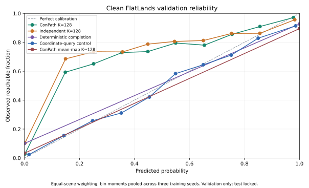
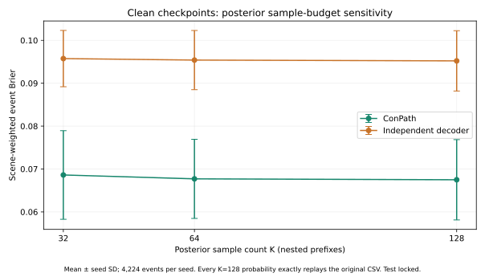

# Clean validation evidence for the working paper

**读取范围更正：旧训练／验证包含原发布test中的8／5条观测，本轮回放也读取了这5条验证观测。更早的512观测查询审计检查过53条物理test观测（含32条ScanNet++）。因此撤回“物理test从未读取”的说法；旧 `test_evaluated=false` 等标志不能证明物理测试未触碰。详见[读取范围更正记录](site/data/flatlands_read_scope_erratum.json)。已停止进一步读取物理test图片，最终留出集需要审核全部历史访问并排除已检查的父级地点。**

**2026-09-09 更正：旧 FlatLands 队列仅隔离子场景 ID，27/160个验证观测与训练共享建筑／地点。旧数值保留为队列诊断，不能证明新建筑泛化；旧子场景配对区间也不是独立建筑总体区间。数据隔离门槛重新打开。当前统一K=4对照、90条论文公开成绩、分组修正和历史帧分析见 [最新中文评估](BASELINE_REVIEW_ZH.md)。**

Generated by `scripts/build_paper_evidence.py` from the frozen reports. All model results are validation-only; physical tests remain locked. Values are mean ± sample SD across training seeds unless only one run is available.

## Same-query FlatLands table

Each method covers the same 4,224 events from 142 contributing validation scenes. Metrics give equal weight to each scene and then each event within that scene.

| Method | Seeds | Brier ↓ | NLL ↓ | ECE ↓ | False-safe at 30% coverage ↓ |
|---|---:|---:|---:|---:|---:|
| ConPath K=128 | 3 | 0.06749 ± 0.00936 | 0.28854 ± 0.01662 | 0.05715 ± 0.00683 | 0.03600 ± 0.00986 |
| Independent K=128 | 3 | 0.09521 ± 0.00703 | 0.78503 ± 0.04690 | 0.08720 ± 0.00741 | 0.03901 ± 0.00748 |
| Deterministic completion | 3 | 0.08857 ± 0.00323 | 1.22362 ± 0.04463 | 0.08857 ± 0.00323 | 0.07293 ± 0.00682 |
| Coordinate-query control | 3 | 0.09204 ± 0.00582 | 0.33411 ± 0.01859 | 0.04302 ± 0.00803 | 0.06965 ± 0.00871 |
| Direct query (one seed) | 1 | 0.09119 | 0.29788 | 0.04076 | 0.05023 |
| Train-fitted radius prior | 1 | 0.15870 | 0.49283 | 0.01661 | 0.11156 |
| ConPath mean-map K=128 | 3 | 0.06957 ± 0.00380 | 0.96118 ± 0.05253 | 0.06957 ± 0.00380 | 0.10509 ± 0.01468 |
| Independent mean-map K=128 | 3 | 0.07184 ± 0.00349 | 0.99248 ± 0.04822 | 0.07184 ± 0.00349 | 0.11023 ± 0.01558 |
| ConPath shuffled worlds (same marginals) | 3 | 0.16139 ± 0.00677 | 1.53947 ± 0.18205 | 0.16433 ± 0.01252 | 0.03908 ± 0.01622 |

The radius prior is one train-fitted control, not an optimization-seed experiment. Direct query currently has one training seed. Binary mean-map/completion controls require fractional acceptance of boundary ties to describe exact coverage; ties never use labels.

## Paired scene evidence

Positive deltas mean the comparator has higher Brier than ConPath. Intervals resample whole scenes 2,000 times per seed (bootstrap seed 20260906). These are exploratory validation intervals, not adjusted multi-comparison significance claims.

| Comparator | Mean Brier delta | Per-seed 95% intervals |
|---|---:|---|
| Independent K=128 | 0.02772 ± 0.00993 | [0.02401, 0.05422]; [0.01617, 0.02815]; [0.01169, 0.03236] |
| Deterministic completion | 0.02107 ± 0.00616 | [0.01417, 0.03882]; [0.01082, 0.03604]; [-0.00357, 0.03258] |
| Coordinate-query control | 0.02455 ± 0.01395 | [0.02357, 0.05456]; [0.00701, 0.03901]; [-0.00248, 0.02594] |
| Direct query (one seed) | 0.03171 | [0.01842, 0.04468] |
| Train-fitted radius prior | 0.09922 | [0.07784, 0.12052] |
| ConPath mean-map K=128 | 0.00208 ± 0.00562 | [-0.00421, 0.01709]; [-0.00855, 0.01690]; [-0.01823, 0.01007] |
| Independent mean-map K=128 | 0.00434 ± 0.00721 | [-0.00544, 0.03078]; [-0.00891, 0.01576]; [-0.01619, 0.01177] |
| ConPath shuffled worlds (same marginals) | 0.09390 ± 0.01497 | [0.07490, 0.12903]; [0.07676, 0.12888]; [0.05520, 0.09903] |

At equal 30% coverage, every ConPath-versus-independent per-seed risk interval includes zero. Lower fixed-threshold false-safe rate is therefore insufficient for a robust equal-coverage safety claim. The same-checkpoint deterministic mean-map comparison is materially stronger than the independent-sampling baseline and must remain in the main table.




## Sample count and marginal controls

| Decoder | K=32 Brier | K=64 Brier | K=128 Brier | Deterministic mean-map Brier | Hidden-map Brier |
|---|---:|---:|---:|---:|---:|
| correlated | 0.06861 ± 0.01032 | 0.06771 ± 0.00923 | 0.06749 ± 0.00936 | 0.06957 ± 0.00380 | 0.15451 ± 0.02207 |
| independent | 0.09575 ± 0.00656 | 0.09540 ± 0.00690 | 0.09521 ± 0.00703 | 0.07184 ± 0.00349 | 0.16789 ± 0.02945 |

K=32/64 are nested prefixes of the original K=128 worlds, using the saved final CUDA generator state. Every original K=128 event probability reproduced exactly across all six checkpoints. This checks the evaluated budgets, not arbitrary-K asymptotic convergence.

The shuffle control independently permutes world indices at each cell. It preserves every empirical cell free count exactly and keeps observed/invalid cells fixed. It isolates sample dependence at evaluation time; it does not replace clean no-event/no-global retraining.




## UnScenes3D observation-conditioned bound

| Split | Frames | Scenes | Event rows | Brier lower bound | Events mutable by unknown completion |
|---|---:|---:|---:|---:|---:|
| train | 478 | 9 | 46701 | 0.13097 | 4.52% |
| validation | 62 | 2 | 4587 | 0.47574 | 15.66% |

Under the frozen adapter, every sampled free set lies between the observed-free-only world and the world with every unknown valid cell free. Disk erosion and connectivity are monotone under free-set inclusion. A positive target unreachable even in the optimistic world, or a negative target reachable even in the pessimistic world, forces squared error one for every posterior honoring those observations. This proves an adapter-conditioned lower bound; it does not imply that better sensor models or softer observation likelihoods cannot help.

The validation lower bound 0.47574 accounts for about 93% of the support-projected v2 mean-map Brier 0.51142. Only 15.66% of events can change through unknown completion. More training under the same hard observation cannot remove the forced error; the next second-domain experiment must first audit a separate observation model using training data.

The bound audit exposed a remaining mean-map postprocessing error: restoring observed-free cells after sampling reopened invalid support. The evaluator and qualitative renderer now apply blocked evidence before a final validity projection. Six original clean checkpoints were replayed at K=128 with the same seeds and chunk size; all hidden-map metrics reproduce exactly and all 27,522 event predictions satisfy the bounds. The superseded v1 CSVs are retained. Corrected correlated/independent Brier is 0.51142 ± 0.00198 / 0.51130 ± 0.00218, still a null transfer diagnostic.


<!-- TRAINING_ABLATIONS_START -->
## Matched clean training ablations

Three seeds per model, on the same frozen 4,224 validation events. Only the named training flag changes. No-event retains event-based validation checkpoint selection; no-global removes global decoder factors while retaining encoder context and local correlation.

| Model | Brier ↓ | NLL ↓ | ECE ↓ | False-safe at 30% coverage ↓ |
|---|---:|---:|---:|---:|
| Full ConPath | 0.06749 ± 0.00936 | 0.28854 ± 0.01662 | 0.05715 ± 0.00683 | 0.03600 ± 0.00986 |
| Without event training loss | 0.20425 ± 0.00322 | 2.53067 ± 0.05699 | 0.21690 ± 0.01933 | 0.05655 ± 0.00582 |
| Without global decoder factors | 0.09499 ± 0.00157 | 0.78486 ± 0.05495 | 0.08592 ± 0.00058 | 0.04288 ± 0.01245 |

Values above are mean ± sample SD across optimization seeds. The paired intervals below resample 142 whole scenes 2,000 times within each seed (bootstrap seed 20260907, frozen before outcomes). Positive deltas favor the full model. Validation was reused for checkpoint selection; these are descriptive, non-multiplicity-adjusted intervals.

| Ablation | Seed | Brier delta (ablation − full) | Paired 95% scene interval | Risk delta at 30% coverage | Paired risk interval |
|---|---:|---:|---:|---:|---:|
| Without event training loss | 20260831 | +0.14277 | [+0.11130, +0.17652] | +0.02661 | [-0.00135, +0.06126] |
| Without event training loss | 20260901 | +0.14274 | [+0.11139, +0.17645] | +0.03006 | [-0.00307, +0.06894] |
| Without event training loss | 20260902 | +0.12475 | [+0.09559, +0.15611] | +0.00498 | [-0.01611, +0.04532] |
| Without global decoder factors | 20260831 | +0.03443 | [+0.01947, +0.04971] | +0.02535 | [-0.00081, +0.05151] |
| Without global decoder factors | 20260901 | +0.03157 | [+0.02185, +0.04192] | -0.00394 | [-0.01384, +0.00388] |
| Without global decoder factors | 20260902 | +0.01649 | [+0.00866, +0.02416] | -0.00077 | [-0.00780, +0.00954] |


All seeds, null intervals and reversals are retained. This bounded-data ablation does not replace external-method comparison, larger matched training, or final testing. Source/radius tables and all seed values are in the [Chinese evaluation summary](EVALUATION_SUMMARY_ZH.md); complete metrics and source hashes are in [the statistical report](site/data/flatlands_clean_training_ablations.json).
<!-- TRAINING_ABLATIONS_END -->

## Reproduce

```bash
PYTHONPATH=src /home/hairo/miniconda3/bin/python3.13 scripts/evaluate_flatlands_clean_controls.py
PYTHONPATH=src /home/hairo/miniconda3/bin/python3.13 scripts/evaluate_flatlands_marginal_shuffle.py
# Reproduce six UnScenes3D mean-map v2 evaluations in fresh output directories:
for prefix in unscenes3d_ground_valid_ unscenes3d_ground_valid_independent_; do
  for seed in 20260831 20260901 20260902; do
    PYTHONPATH=src /home/hairo/miniconda3/bin/python3.13 scripts/evaluate_unscenes3d_conpath_mean_map.py \
      --checkpoint "results/${prefix}support_clamped_f16_v1/seed${seed}/best.pt" \
      --output-dir "results/${prefix}support_clamped_mean_map_k128_v2/seed${seed}" \
      --seed "$seed" --validation-samples 128 --sample-chunk 16
  done
done
PYTHONPATH=src /home/hairo/miniconda3/bin/python3.13 scripts/audit_unscenes3d_observation_ceiling.py
PYTHONPATH=src /home/hairo/miniconda3/bin/python3.13 scripts/analyze_flatlands_clean_validation.py --controls-root results/paper_clean_checkpoint_controls_v1 --shuffle-root results/paper_clean_marginal_shuffle_v1 --publish-site
/home/hairo/miniconda3/bin/python3.13 scripts/build_paper_evidence.py
```

Completed checkpoint controls verify their manifests when resumed. The shuffle command refuses to overwrite completed outputs; reproduce it in a fresh checkout/result directory. Raw data and checkpoints remain ignored by Git. SVG and PDF figures are included under `site/assets/`.
